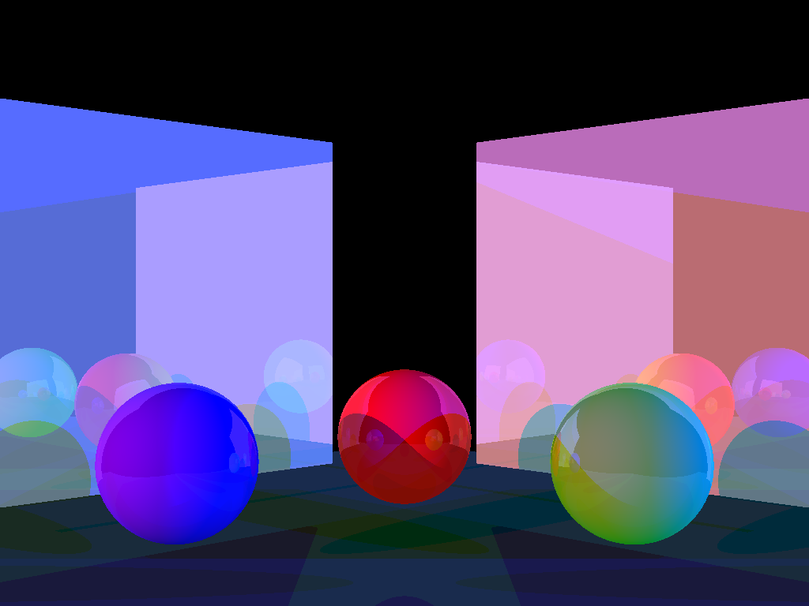

# Project 4: Illuminate

Please fill this out for Illuminate only. The project handout can be found [here](https://cs1230.graphics/projects/ray/2).

## Output Comparison
Run the program with the specified `.ini` file to compare your output (it should automatically save to the correct path).
> If your program can't find certain files or you aren't seeing your output images appear, make sure to: 
> 1. Set your working directory to the project directory
> 2. Set the command-line argument in Qt Creator to `template_inis/illuminate/<ini_file_name>.ini`
> 3. Clone the `scenefiles` submodule. If you forgot to do this when initially cloning this repository, run `git submodule update --init --recursive` in the project directory

> Note: once all images are filled in, the images will be the same size in the expected and student outputs.

| File/Method To Produce Output | Expected Output | Your Output |
| :---------------------------------------: | :--------------------------------------------------: | :-------------------------------------------------: | 
| point_light_1.ini |   |  |
| point_light_2.ini |   |  |
| spot_light_1.ini |   |  |
| spot_light_2.ini |   |  |
| simple_shadow.ini |   |  |
| shadow_test.ini |   |  |
| shadow_special_case.ini |   |  |
| reflections_basic.ini |   |  |
| reflections_complex.ini |   |  |
| texture_cone.ini |   |  |
| texture_cone2.ini |   |  |
| texture_cube.ini |   |  |
| texture_cube2.ini |   |  |
| texture_cyl.ini |   |  |
| texture_cyl2.ini |   |  |
| texture_sphere.ini |   |  |
| texture_sphere2.ini |   |  |

## Design Choices
(Fixes from last project: No longer repeats calculation of ViewMatrix and InverseViewMatrix)

For this project I heavily relied on my pre-existing structs and my new structs to build on my rayTracer. I create an illumination file that tackles all the aaspects of illuminating the shapes. It is here that I implement phong and the shadow logic that determines when a shadow needs to be cast. Separating Phong into it's own file allowed my code to be better compartmentalized and also allowed me to implement my recursive traceRay function.

I modify my traceRay function so that it caan be recursive and account for reflection. I keep a counter that determines my recursive depth.

For texture I make changes to my code by adding a textureInfo struct which comes in handy when i'm storing information for a texture file. I make an important decision here to create a map of the primirive filenames to the texture they map to. I populate this map beforehand so that there is no wasted computation as the shape textures are constant for a scene and hence can be stored before. To account for my UV coordinates I add two more vars to my intersectInfo struct.

## Collaboration/References

## Known Bugs
Noticed no bugs on the required files. Could take more steps to optimize performance.

## Extra Credit
