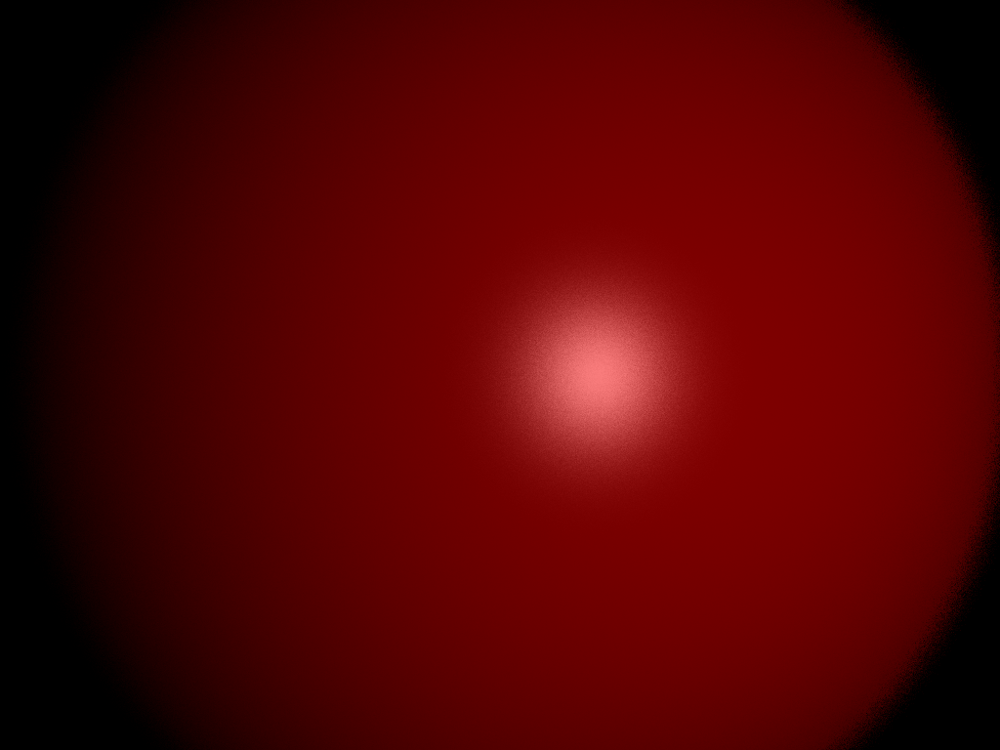
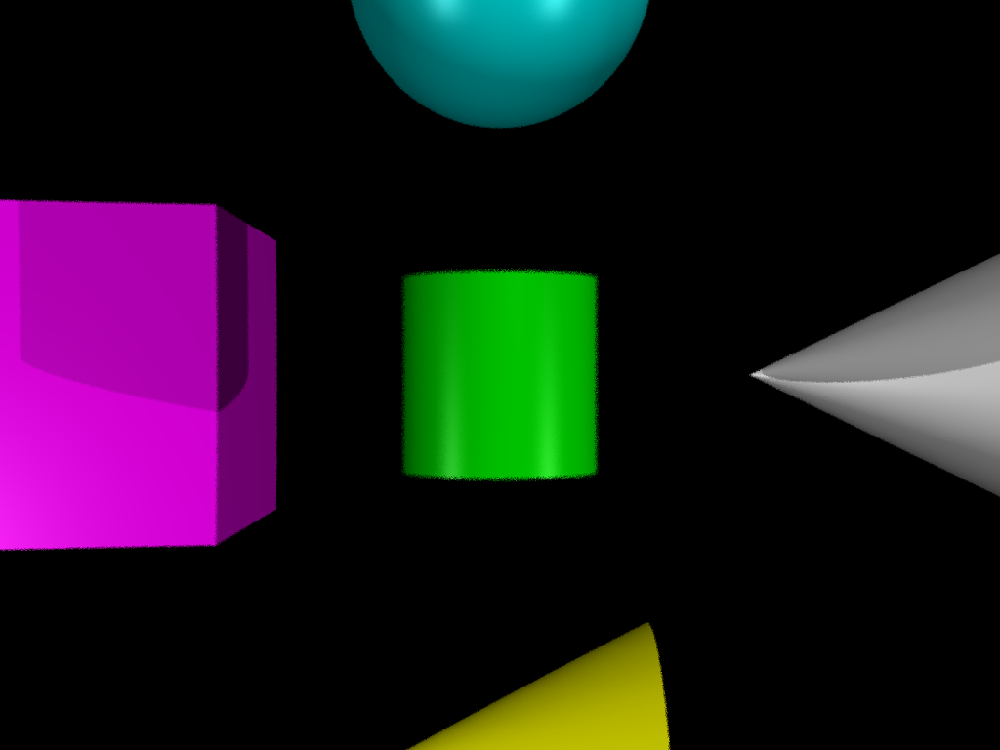

## Project 3: Intersect

Please fill this out for Intersect only. The project handout can be found [here](https://cs1230.graphics/projects/ray/1).

### Output Comparison
Run the program with the specified `.ini` file to compare your output (it should automatically save to the correct path).
> If your program can't find certain files or you aren't seeing your output images appear, make sure to: 
> 1. Set your working directory to the project directory
> 2. Set the command-line argument in Qt Creator to `template_inis/intersect/<ini_file_name>.ini`
> 3. Clone the `scenefiles` submodule. If you forgot to do this when initially cloning this repository, run `git submodule update --init --recursive` in the project directory

> Note: once all images are filled in, the images will be the same size in the expected and student outputs.

| File/Method To Produce Output | Expected Output | Your Output |
| :---------------------------------------: | :--------------------------------------------------: | :-------------------------------------------------: |
| unit_cone.ini |   |  |
| unit_cone_cap.ini |  |  |
| unit_cube.ini |  |  |
| unit_cylinder.ini |  |  |
| unit_sphere.ini |  |  |
| parse_matrix.ini |  |  |
| ambient_total.ini |  |  |
| diffuse_total.ini |  |  |
| specular_total.ini |  |  |
| phong_total.ini |  |  |
| directional_light_1.ini |  |  |
| directional_light_2.ini |  |  |

### Design Choices
Overall, I delegate the functionality of render into a helper called getUpdatedPixel in rayTraceScene.cpp. I use several helper methods in my primary getIntersection method which checks the primitive type and then calls upon helper methods accordingly. I use a few specialized structs that in a sense wrap the t value of the intersection, the normal, and the shape. These structs were especially helpful when returning a normal corresponding to a specific t value whic in turn could correspond to a specific shape.

The surface struct was particularly useful for computing the primitive that was closest to the camera and were computing which side within the object's space was closest to camera. In addition, I use a ray struct which always has two glm::vec4s one for position and one for direction.

### Collaboration/References

### Known Bugs
I could not find any known bugs with the required outputs.

There are some design limitations I would like to address before illuminate:
1) I tried implementing a shape interface using the virtual functions mentioned in the advanced c++ guide. However, it failed to integrate with the way my program computes the normal and intersection. Adding the interface would allow me to improve its modularity and add new features to the existing program structure.

2) In my getViewMatrix and getInverseViewMatrix I perform some expensive calculations repeatedly. I could instead store the computations as member variables and return these variables in the getters instead. However, when I tried to implement this my code encountered some bugs which I believe arose from the rules of initializing fields in C++. I would like to optimize this for illuminate.

### Extra Credit
